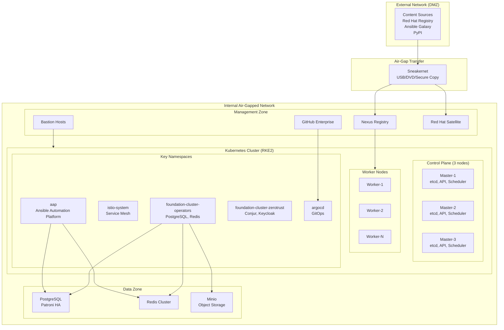
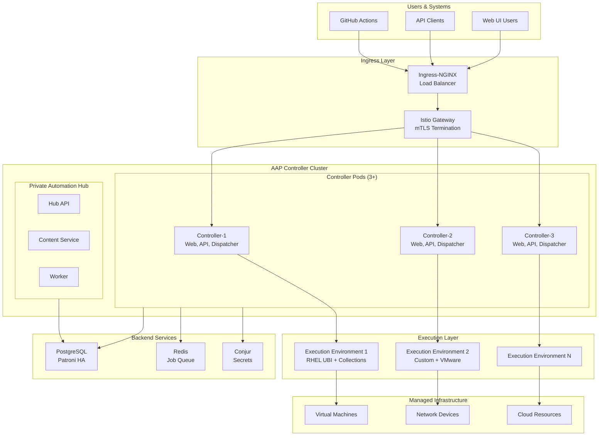
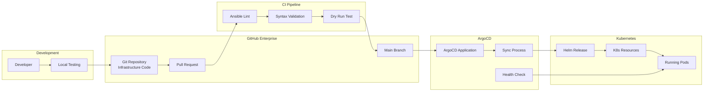
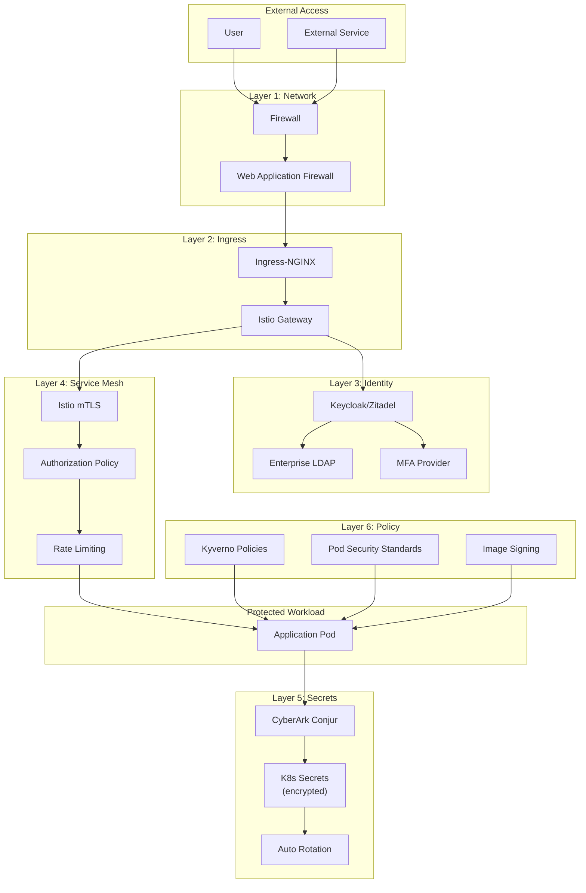
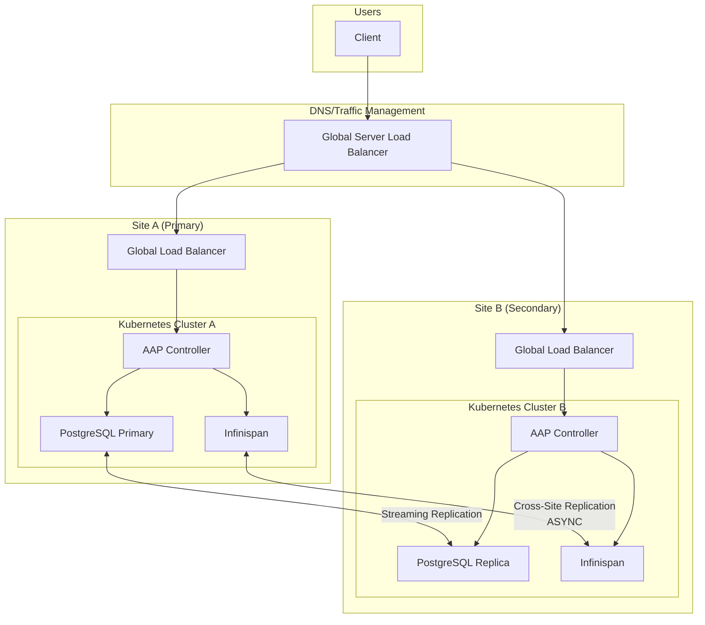
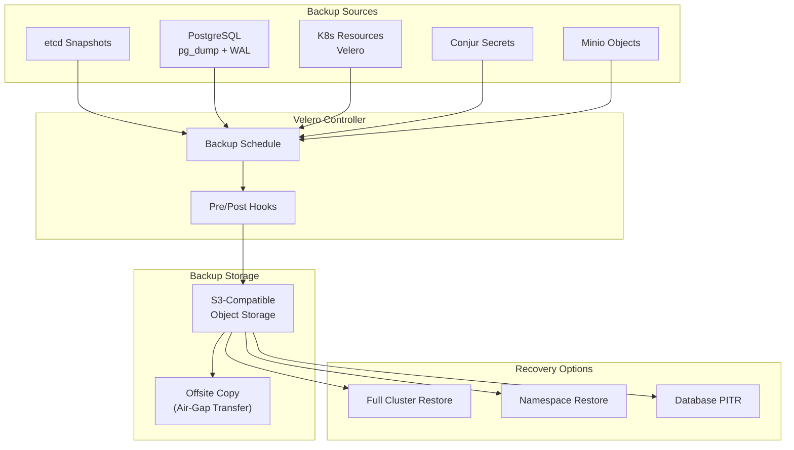
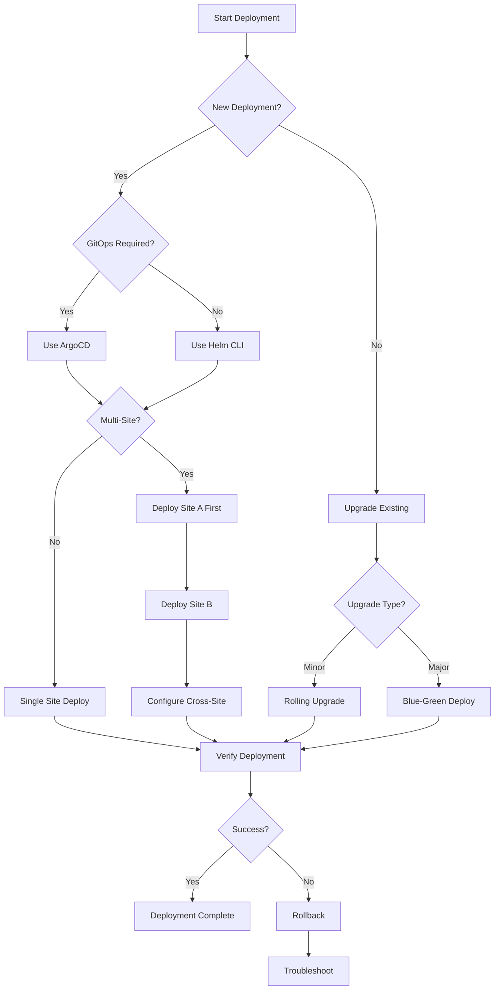
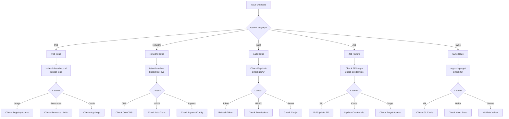
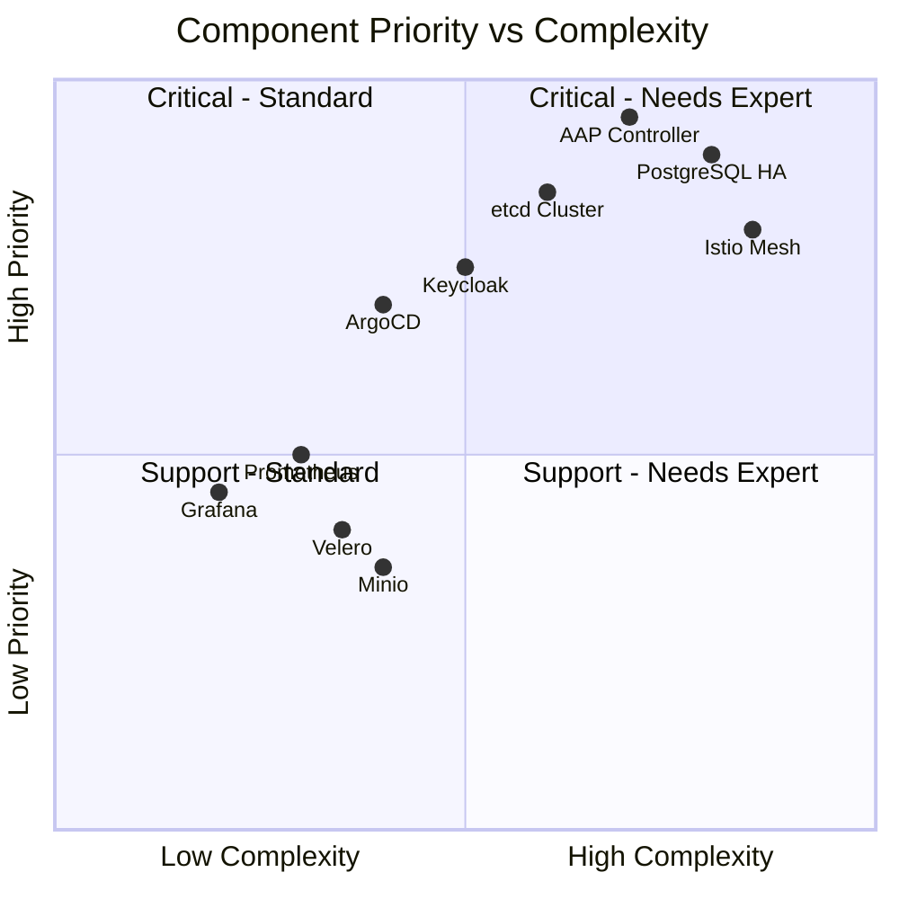
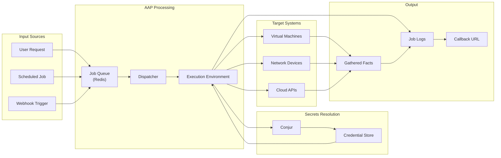

# Architecture Diagrams (Mermaid Format)

These diagrams can be rendered in GitHub, GitLab, or any Mermaid-compatible viewer.

---

## 1. High-Level Infrastructure Overview

---

## 2. AAP Controller Architecture

---

## 3. GitOps Deployment Flow

---

## 4. Security Architecture

---

## 5. Multi-Site Architecture

---

## 6. Backup & Recovery Flow

---

## 7. Deployment Decision Flowchart

---

## 8. Troubleshooting Decision Tree

---

## 9. Component Priority Matrix

---

## 10. Data Flow Diagram

---

## Usage Notes

1. **GitHub/GitLab**: These diagrams render automatically in markdown files
2. **VS Code**: Install "Markdown Preview Mermaid Support" extension
3. **Export**: Use [Mermaid Live Editor](https://mermaid.live) for PNG/SVG export
4. **Documentation**: Embed in Confluence using Mermaid macro
